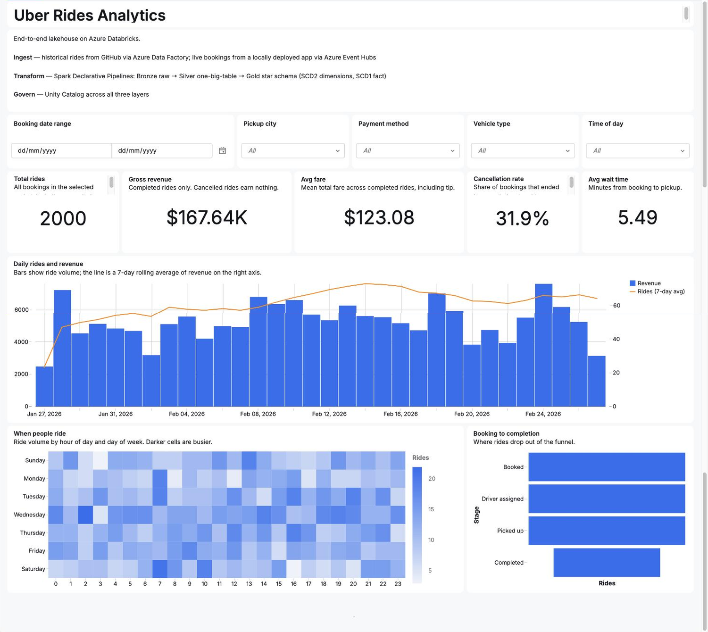
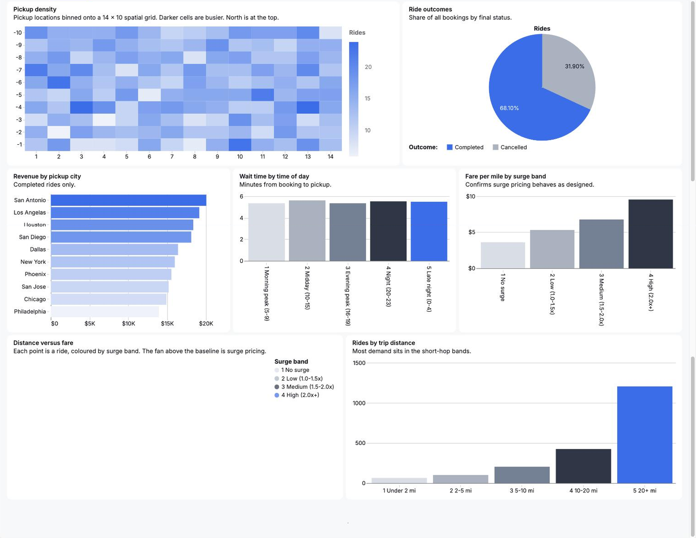
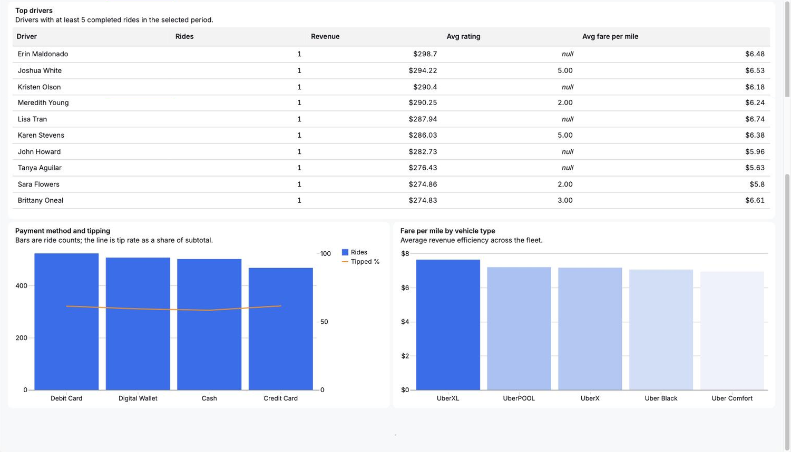

# Uber Rides Lakehouse — Azure Databricks

End-to-end lakehouse: batch and streaming ingestion, declarative medallion
pipeline, dimensional star schema, and an AI/BI dashboard — all governed by
Unity Catalog.



📊 Dashboard PDFs — **[Overview](docs/uber-rides-dashboard-overview.pdf)** ·
**[Operations](docs/uber-rides-dashboard-operations.pdf)** ·
**[Revenue & riders](docs/uber-rides-dashboard-revenue-and-riders.pdf)**

---

## The dashboard

Three pages over the gold star schema, filtered by a shared date range plus
pickup city, payment method, vehicle type and time of day. The Overview page is
pictured above.

### Operations



### Revenue & riders



---

## Architecture

```
                    ┌──────────────────────┐
  GitHub (history)  │  Azure Data Factory  │──┐
                    └──────────────────────┘  │
                                              ▼
  Local ride-booking app ──▶ Azure Event Hubs ──▶  BRONZE
                                                     │  raw ingest, schema-on-read
                                                     ▼
                                                  SILVER
                                                     │  one big table, joined + conformed
                                                     ▼
                                                   GOLD
                                                     │  star schema: 1 fact, 8 dimensions
                                                     ▼
                                            AI/BI Dashboard
```

**Ingestion — two paths converging at bronze**
- *Batch:* historical ride files pulled from GitHub by Azure Data Factory
- *Streaming:* a locally deployed booking app emitting live events to Azure Event Hubs

**Transformation — Spark Declarative Pipelines (Lakeflow)**
- Bronze: raw landing, streaming tables for events, materialized views for reference data
- Silver: `silver_obt` — one big table joining rides to all reference dimensions
- Gold: dimensional model, SCD Type 2 dimensions, SCD Type 1 fact via AUTO CDC

**Governance —** Unity Catalog across all three layers, with lineage and data
quality expectations enforced in-pipeline.

---

## The data model

| Table | Type | SCD | Grain |
|---|---|---|---|
| `fact_rides` | streaming table | 1 | one row per ride |
| `dim_driver` | streaming table | 2 | one row per driver version |
| `dim_passenger` | streaming table | 2 | one row per passenger version |
| `dim_vehicle` | streaming table | 2 | one row per vehicle version |
| `dim_date` | materialized view | — | one row per calendar day |
| `dim_city`, `dim_payment_method`, `dim_ride_status`, `dim_cancellation_reason` | materialized views | 1 | reference data |

## Repository layout

```
├── pipelines/              Spark Declarative Pipelines source
│   ├── bronze/             Event Hubs stream, ADLS landing, staging table
│   ├── silver/             silver_obt - one big table
│   └── gold/               fact_rides + 8 dimensions
│   └── uber_rides_ingestion.settings.json
├── sql/                    Dashboard dataset queries
├── dashboard/              Exported .lvdash.json
├── docs/
│   ├── images/             Dashboard screenshots
│   └── *.pdf               Dashboard page exports
└── README.md
```

---

## Running it yourself

The pipeline is a Lakeflow Spark Declarative Pipeline. Import the source into a
workspace folder, then point a pipeline at it using the settings in
`pipelines/uber_rides_ingestion.settings.json`:

```bash
databricks auth login --host https://<your-workspace>.azuredatabricks.net
databricks workspace import-dir pipelines /Workspace/Users/<you>/Uber_Project
databricks pipelines create --json @pipelines/uber_rides_ingestion.settings.json
```

The Event Hubs connection string is read from a Unity Catalog secret, not from
source. Create it before the first run:

```bash
databricks secrets put-secret uber_project bronze \
  --json '{"key": "uber_event_hub_connection_string"}'
```

Then import `dashboard/uber_rides_analytics.lvdash.json` as an AI/BI dashboard
and point it at `uber_project.gold`.

---

## Data quality

Expectations are enforced in-pipeline rather than checked after the fact:

| Layer | Expectation | Action |
|---|---|---|
| Bronze | `ride_id IS NOT NULL` | drop |
| Bronze | `total_fare >= 0` | drop |
| Silver | `pickup_timestamp >= booking_timestamp` | warn |
| Silver | referential integrity on all dimension keys | warn |
| Gold | `COUNT(*) = COUNT(DISTINCT ride_id)` | validation query |

Results surface on the dashboard's Data Quality page, sourced from the
pipeline event log.

---

## Notes

The dataset is synthetic, generated to simulate realistic ride patterns —
commute peaks, weekend nightlife demand, surge pricing, and cancellation
behaviour. No real rider or driver data is used.

## Stack

Azure Data Factory · Azure Event Hubs · Azure Databricks · Spark Declarative
Pipelines (Lakeflow) · Unity Catalog · Delta Lake · Databricks SQL · AI/BI
Dashboards · Databricks Asset Bundles
